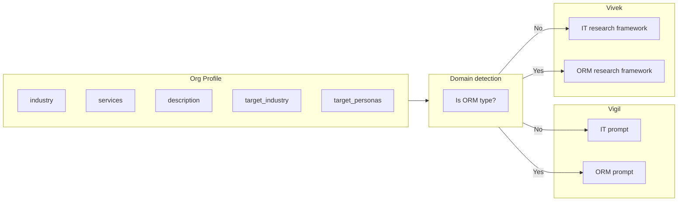

# Plan: Profile-Driven Agents + UI/UX and Input Changes

## Part 1 — Goal and scope

**Goal:** One codebase, one set of agents (Vigil, Vivek). Behaviour is driven by the **org profile** (Company Profile + Monitoring Rules). No hardcoded industry or domain. Works for: **Energy / utility / power** (e.g. Schneider Electric), **Telecom** (e.g. Airtel, Jio), **Conglomerates / multi-industry** (e.g. Reliance: Power, Oil & Gas, Telecom, Data Centers, E-commerce), **ORM** (e.g. Onlynereputation.com), and any other B2B company that sets profile and monitoring.

**Scope:** Backend (Vigil, Vivek, generate-profile, generate-monitoring) + **UI/UX and inputs** (Company tab, Monitoring, Playbook start modal and step copy, Research templates/placeholders, Signals filters).

---

## Part 1a — Reference: Onlynereputation.com (example profile)

*(Kept for reference; agents will use whatever profile the org has, not only ORM.)*

From [onlynereputation.com](https://onlynereputation.com): Services (Develop Positive Reputation, Remove Negative Comment, Reputation Monitoring, etc.); target industries (Hospitality, Healthcare, Real Estate, Wellness, Education, Ecommerce, etc.); personas (CEO, Marketing Head, Communications Manager); signals (Reputation Crisis, Negative Reviews, Bad Publicity, Leadership, Expansion, Scandal). Geography: India, USA, UK, Australia.

From [onlynereputation.com](https://onlynereputation.com) and [industries page](https://onlynereputation.com/industries):

**What they do**

- Online Reputation Management (ORM): remove bad reviews, negative content and links from Google, fake reviews; remove personal information, images, and name from search; build positive reputation; improve ratings, Knowledge Panel, Google Suggest; protect privacy; recover and monitor reputation.

**Services (for org profile / agents)**

- Develop Positive Reputation  
- Remove Negative Comment / negative content from Google  
- Online Reputation Monitoring  
- Recover Online Reputation  
- Build and Manage Reputation  
- Repair Search Suggestion (Google Suggest)  
- Develop your Brand  
- Protect your Privacy  
- Repair Search Results

**Target industries**

- Hospitality (Family Restaurants, Hotels, Cab Service, Bar & Disco, Holiday Planners, Travel Agencies)  
- Healthcare (Hospitals, Private Clinics, Dental, Eye Care, Medical Practitioners, Rehabilitation)  
- Real Estate (Builders, Developers, Brokers, Online Portals)  
- Wellness (Spa, Gym, Beauty/Hair/Skin Clinics, Yoga, Meditation, De-addiction)  
- Education & Training (Schools, Coaching, Colleges, EdTech)  
- Ecommerce (Shopping/Booking/Recharge portals)  
- Consulting (Education, HR/Manpower, Immigration)  
- IT and ITES Consulting  
- Professionals and Celebrities (CEO/CTO/COO/MD, Celebrity, Politician)

**Target personas (who buys ORM)**

- CEO, CTO, COO, MD  
- Marketing Head, VP Sales  
- Communications Manager  
- Restaurant / Hotel owner (implicit from testimonials and industries)

**Relevant buying signals for ORM**

- **Reputation crisis / bad publicity** — negative press, fake review scandals, brand damage  
- **Negative reviews** — surge of bad reviews, review-related news  
- **Leadership** — new Marketing Head, Communications Manager, CMO (care about brand)  
- **Expansion** — new locations/brands (more review surface, more need to protect reputation)  
- **Regulatory / privacy** — data breach, privacy violation, need to clean up  
- **Scandal** — celebrity/politician or brand controversy

**Geography**

- India (primary; “leading ORM companies in India”), plus USA, UK, Australia (from testimonials).

---

## Part 2 — How behaviour is driven (no UI change to flow)

Use the **existing** Vigil and Vivek agents; behaviour is driven only by the org profile (no domain detection). When the org looks like an ORM business (e.g. industry/description/services mention “reputation”, “ORM”, “reviews”, “negative content”), switch to ORM-specific prompts, signal tags, and research framework. No new agent is required unless you later want a dedicated “Onlyne” agent.

- **Company Profile** (Settings): services, target_industry, target_personas, target_geography drive Vigil/Vivek prompts and search. **Monitoring:** signal_types, keywords. Vigil uses **profile.services** for save_signal; Vivek uses **profile.target_personas** for decision makers. Search uses **target_geography** and **target_industry**. Extended signal tags and industry options in shared constants.

---

## Part 2a — UI/UX and input changes

### Company tab (Settings)

- **Current:** Multi-URL, Generate (scrapes and fills profile), Save. **Change:** Optional copy that profile drives Vigil and Vivek. Generate-profile API prompt made domain-agnostic so it works for energy, telecom, ORM, conglomerates.

### Monitoring Rules tab (Settings)

- **Industries:** Extend list to include **Energy**, **Utilities**, **Oil & Gas**, **Telecom**, **Hospitality**, **Wellness**, **Real Estate** (same list as Company target industry). Single source: e.g. `INDUSTRY_OPTIONS` in settings (Hospitality already added).
- **Signal types:** Extend `ALL_SIGNAL_TYPES` with **Reputation Crisis**, **Negative Reviews**, **Bad Publicity**, **Scandal**. Generate-monitoring prompt uses extended industries and signal types.

### Playbook — Start modal

- **Industry list:** Use same industry options as Settings (e.g. import shared `INDUSTRY_OPTIONS`) so Playbook "Target industry" includes Energy, Telecom, Hospitality, etc. File: [src/components/PlaybookStartModal.tsx](src/components/PlaybookStartModal.tsx).

### Playbook — Step copy and suggested queries

- **Step 3 (Deep Research):** Change description from "Run 3 targeted Vivek research queries — leadership, tech stack, and pitch angle" to generic: "Run targeted Vivek research — leadership, key initiatives, and pitch angle." File: [src/app/home/playbook/page.tsx](src/app/home/playbook/page.tsx) — `STEP_DEFS`.
- **Step 4 (Find Signals):** Change from "Vigil scans for buying triggers — leadership changes, funding, expansion, tech investments" to: "Vigil scans for buying triggers relevant to your offerings — leadership, funding, expansion, and other signals you monitor."
- **Suggested research queries:** Today `getResearchQueries(company)` returns hardcoded "digital transformation, technology stack, AI/automation" and "AI sales intelligence". Change to generic: e.g. "Deep dive into [company] — key initiatives, leadership, and best entry angle for our offerings"; "Who to contact at [company] and best entry angle?"; "How to pitch our solutions to [company] — pain points and ROI angles."

### Research page

- **Templates:** Optionally soften "Company Deep Dive" from "tech stack and key technologies" to "key initiatives and capabilities". Other templates already generic. File: [src/app/research/page.tsx](src/app/research/page.tsx).

### Signals page

- **Filter tags:** Use same extended signal list as Monitoring (or `ALL_SIGNAL_TYPES`) so filter chips include new tags (Reputation Crisis, Bad Publicity, etc.). File: [src/app/home/signals/page.tsx](src/app/home/signals/page.tsx) — `SIGNAL_TAGS` or derive from shared constant.

---

## Part 3 — Implementation tasks

### 3.1 Remove domain detection; make agents profile-driven

- **Where:** New shared helper (e.g. `src/lib/org-domain.ts`) or inside each agent file.
- **Logic:** Treat org as ORM if any of:
  - `profile.industry` (string or comma-separated) contains “reputation”, “ORM”, “reputation management” (case-insensitive), or
  - `profile.description` contains “reputation”, “reviews”, “negative content”, “ORM”, or
  - `profile.services` (array) has any item matching those keywords.
- **Export:** `isReputationManagementOrg(profile: Record<string, unknown>): boolean`.

### 3.2 Vigil — profile-driven (no ORM/IT branch)

- **File:** [src/app/api/agents/vigil/route.ts](src/app/api/agents/vigil/route.ts)
- **Changes:**
  1. Single generic system prompt driven by buildOrgContext. No domain helper. If ORM:
    - Build an **ORM-specific system prompt block** that replaces or overrides the IT-focused part:
      - **Mission:** Find signals that indicate a company/person may need reputation management (negative reviews, bad publicity, reputation crisis, scandal, expansion, new marketing/comms leadership).
      - **Signal tags:** `Reputation Crisis`, `Negative Reviews`, `Bad Publicity`, `Leadership`, `Expansion`, `Regulatory`, `Scandal` (and keep `Funding`, `M&A` if useful).
      - **Personas to watch:** From org profile (e.g. Marketing Head, Communications Manager, CEO, MD, Restaurant Owner); when finding Leadership signals, call `save_contact` for these roles.
      - **Services in save_signal:** Use org `profile.services` (e.g. “Remove Negative Comment”, “Reputation Monitoring”) instead of hardcoded AI/GenAI, Cloud, ERP.
      - **Search focus:** e.g. “reputation crisis OR negative reviews OR bad publicity OR scandal” and target geography (India, etc.) from profile; avoid forcing “enterprise technology”.
    1. In `executeTool` for `search_news`: when ORM, pass a query suffix that reflects reputation/ORM and org target geography (from profile), not “India enterprise technology”.
    2. **getTagColor:** Extend the tag → color map for new tags: `Reputation Crisis`, `Negative Reviews`, `Bad Publicity`, `Scandal` (e.g. red/orange/purple) so UI stays consistent; unknown tags already fall back to `'blue'`.
  2. Keep existing IT behavior when not ORM (unchanged prompt and search suffix).

### 3.3 Vivek — ORM mode

- **File:** [src/app/api/agents/vivek/route.ts](src/app/api/agents/vivek/route.ts)
- **Changes:**
  1. After `buildOrgContext(ctx.orgId)`, use the same domain helper. If ORM:
    - Build an **ORM-specific research framework** and inject it (or replace the IT framework in the system prompt):
      - **Sections:** (1) Company/Brand overview, (2) Online presence & review footprint, (3) Recent reputation events (negative press, fake reviews, scandals), (4) Pain points (reputation damage, negative content), (5) Buying signals (reputation crisis, expansion, leadership), (6) Our service fit — map to org `profile.services`, (7) Key decision makers & entry points — use **profile.target_personas** (Marketing Head, Communications Manager, CEO, MD, Owner, etc.); still require minimum 3–5 contacts by name with conversation angle and LinkedIn if found.
    1. **search_company:** For ORM, when building the search query, include reputation/industry context (e.g. “reputation”, “reviews”, “hospitality”, “restaurant”) and target geography instead of “India enterprise technology 2025”.
  2. When not ORM, keep current IT framework and search behavior.

### 3.4 Settings — ORM signal types and Monitoring

- **File:** [src/app/settings/page.tsx](src/app/settings/page.tsx)
- **Change:** Extend `ALL_SIGNAL_TYPES` to include ORM-relevant tags so Monitoring Rules and Vigil can use them:
  - Add: `'Reputation Crisis'`, `'Negative Reviews'`, `'Bad Publicity'`, `'Scandal'`.
  - Keep existing: Funding, Expansion, Leadership, Tech Adoption, M&A, Regulatory, Challenges, Business Initiatives.
- **File:** [src/app/api/settings/generate-monitoring/route.ts](src/app/api/settings/generate-monitoring/route.ts)
- **Change:** In the LLM prompt:
  - Extend **signal_types** options to include the new ORM tags when the company profile suggests ORM (e.g. description/services mention reputation/reviews), or always include them in the allowed list and let the LLM choose.
  - Ensure **industries** list includes “Hospitality” (and optionally “Wellness”, “Real Estate”) so Onlyne’s generated monitoring rules can target restaurants, hotels, etc.

### 3.5 Generate profile from website

- **File:** [src/app/api/settings/generate-profile/route.ts](src/app/api/settings/generate-profile/route.ts)
- **Change:** Make the prompt **domain-agnostic** (or add ORM hint):
  - Either remove the strict “B2B sales consultant” / “technology” framing or add a note: “If the company is in reputation management, ORM, or similar, set industry and services accordingly (e.g. Reputation Management, Remove Negative Content, Build Positive Reputation) and target industries/personas appropriate for that business.”
  - This allows “Generate from website” for Onlynereputation.com to produce industry “Reputation Management”, services as above, and target_industry including Hospitality, Healthcare, Real Estate, etc., and target_personas including Marketing Head, Communications Manager, CEO, MD.

### 3.6 Optional: seed document for Onlyne

- **Deliverable:** A short internal or user-facing doc (e.g. `docs/onlyne-reputation-profile.md` or a comment in code) that summarizes the website-derived profile (services, industries, personas, signals) so onboarding Onlynereputation.com and future ORM tenants is consistent. No code dependency.

---

## Part 4 — What stays the same

- **No new agent route** — Vigil and Vivek are extended, not duplicated.
- **Schema** — `signals.tag` and `signals.services` are already flexible (text and text[]); new tags and org-driven services need no migration.
- **Org context** — `buildOrgContext(orgId)` already injects profile and monitoring; ORM mode only changes the **base** prompt and search query construction.

---

## Part 5 — Testing and validation

1. **Org setup:** Register or use an org with profile set to Onlynereputation.com (industry: “Reputation Management”, services and target industries/personas as in Part 1).
2. **Vigil:** Run signal search for a few keywords (e.g. “restaurant negative reviews India”, “hotel reputation crisis”). Confirm saved signals use ORM tags and org services, and search query no longer forces “enterprise technology”.
3. **Vivek:** Run research on a restaurant or hotel brand. Confirm report uses ORM framework (reputation events, review footprint, decision makers from profile) and “Our service fit” uses org services.
4. **Generate profile:** Point generate-profile at onlynereputation.com; confirm industry, services, target_industry, and target_personas are ORM-appropriate.
5. **Generate monitoring:** With Onlyne profile, run “Generate monitoring rules”; confirm signal_types can include Reputation Crisis, Bad Publicity, etc., and industries include Hospitality.

---

## Summary

| Item                               | Action                                                                                              |
| ---------------------------------- | --------------------------------------------------------------------------------------------------- |
| Onlynereputation.com understanding | Captured in Part 1 (services, industries, personas, signals).                                       |
| Domain detection                   | New helper `isReputationManagementOrg(profile)`.                                                    |
| Vigil                              | ORM-specific prompt, signal tags, search suffix, getTagColor; use profile.services for save_signal. |
| Vivek                              | ORM-specific research framework and search_company query; use profile for personas and service fit. |
| Settings                           | Extend ALL_SIGNAL_TYPES with ORM tags.                                                              |
| generate-monitoring                | Add ORM signal types and Hospitality (and related) to industries in prompt.                         |
| generate-profile                   | Make prompt domain-agnostic or ORM-aware so Onlyne website produces correct profile.                |
| New agent                          | Not in scope; can be added later if a dedicated “Onlyne” agent is desired.                          |

